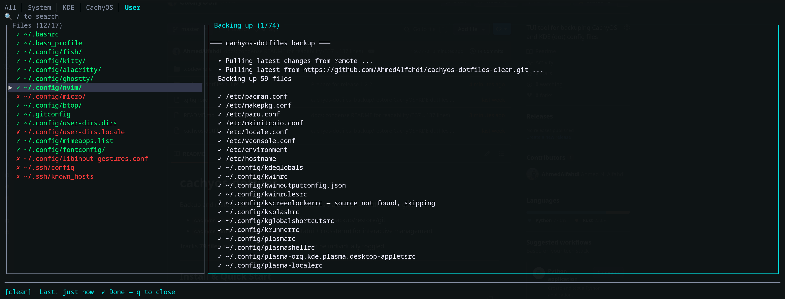

# cachyos-dotfiles

Backup and restore CachyOS + KDE Plasma dotfiles via GitHub — with per-file granularity.

- **`cachyos-dotfiles`** — Python CLI (stdlib only) for backup/restore/git
- **`cachyos-dotfiles-tui`** — Rust TUI (ratatui + crossterm) for interactive management

Tracks **79 files** across 4 categories. Every file can be individually toggled.



---

## Install & Quick Start

```bash
# Install the TUI (recommended)
cargo install cachyos-dotfiles-tui

# Clone for the CLI + manifest
git clone https://github.com/AhmedAlfahdi/CachyOS.f.git
cd CachyOS.f && chmod +x cachyos-dotfiles

# Run the wizard
cachyos-dotfiles-tui --wizard
```

The wizard handles GitHub auth, repo setup, and offers an immediate backup.

Already set up?
```bash
cachyos-dotfiles-tui              # TUI
./cachyos-dotfiles backup          # CLI backup
./cachyos-dotfiles restore         # CLI restore
```

---

## The TUI

Keyboard-driven, single binary, zero runtime deps.

| Key | Action |
|-----|--------|
| `↑` `↓` `j` `k` | Navigate |
| `Space` / `Enter` | Toggle file |
| `1`–`4` | Jump to category |
| `Tab` / `Shift+Tab` | Next/prev category |
| `!` `@` `#` `$` | Batch toggle category |
| `/` | Filter (`Esc` to clear) |
| `b` | Backup (with spinner) |
| `r` | Restore all |
| `R` | Restore selected file |
| `d` | Diff file vs repo |
| `h` | Help |
| `q` | Quit |

**Color legend:** 🟢 enabled · 🔴 disabled · 🟡 needs sudo · 🟣 security-sensitive

**Status bar:** `[clean]` / `[3Δ]` (3 changed files) / `[no repo]`

---

## The Python CLI

Single-file, stdlib only. All ops available from the command line.

| Command | Description |
|---------|-------------|
| `init [--repo URL]` | Create config + manifest, clone GitHub repo |
| `backup` | Copy enabled files → commit → push |
| `restore [--dry-run] [--yes]` | Pull → backup existing → write to system |
| `list [--category X]` | Show tracked files with status |
| `enable <path>` / `disable <path>` | Toggle file tracking (fuzzy match) |
| `diff [path]` | Diff system vs repo |
| `status` | Git status of local repo |
| `pkglist export\|import` | Export/import installed packages |

---

## What's Tracked

**79 files** across 4 categories:

- **System (10):** pacman, makepkg, paru, mkinitcpio, locale, vconsole, environment, hostname, sddm (disabled), grub (disabled)
- **KDE Plasma 6 (47):** kdeglobals, kwinrc, kwinoutputconfig, kwinrulesrc, kscreenlockerrc, kglobalshortcutsrc, krunnerrc, plasmarc, plasmashellrc, plasma applets, dolphinrc, konsolerc, katerc, GTK bridges, and more
- **CachyOS (2):** cachyos app configs
- **User (20):** shell (bash, fish), terminals (kitty, alacritty, ghostty), editors (nvim + LazyVim, micro), gitconfig, fontconfig, btop, SSH (disabled), and more

Disabled by default: KWallet, KDE Connect, SSH keys/hosts, Bluetooth.

---

## How It Works

**Backup:** read manifest → filter enabled → copy files to git repo → export package list → commit + push

**Restore:** pull from GitHub → backup existing files → write from repo (sudo for /etc) → offer package install

**Security:** `~/.ssh/`, `kwalletrc`, and `kdeconnect/` are disabled by default. Review with `list` before first backup.

---

## File Locations

| Item | Path |
|------|------|
| TUI binary | `~/.cargo/bin/cachyos-dotfiles-tui` |
| Config | `~/.config/cachyos-dotfiles/config.json` |
| Manifest | `~/.config/cachyos-dotfiles/manifest.json` |
| Local git repo | `~/.local/share/cachyos-dotfiles/repo/` |
| Restore backups | `~/.config/cachyos-dotfiles/backups/<timestamp>/` |

## Requirements

- **Python CLI:** Python 3.8+, `git`, `pacman` (Arch/CachyOS), `gh` CLI (HTTPS auth)
- **Rust TUI:** Rust toolchain ([rustup](https://rustup.rs)), installed via `cargo install`

---

## Tips

- Restart Plasma after restoring KDE configs: `systemctl --user restart plasma-plasmashell`
- Monitor layout (`kwinoutputconfig.json`) has display UUIDs — KWin usually handles this across installs
- Backup before system updates: press `b` in the TUI or `./cachyos-dotfiles backup`
- Automate: `0 20 * * * cd ~/CachyOS.f && ./cachyos-dotfiles backup`
- No sudo needed for backup — system files are world-readable. Only restore needs sudo.

---

## Troubleshooting

| Symptom | Fix |
|---------|-----|
| "Manifest not found" | Run `cachyos-dotfiles-tui --wizard` |
| TUI can't find CLI | Run from project root (`~/CachyOS.f/`) |
| TUI doesn't start | Terminal ≥ 24 rows; try `export TERM=xterm-256color` |
| Permission denied (publickey) | Use HTTPS: `gh auth login` |
| Restore asks for password | Check terminal behind the TUI — system files need sudo |
